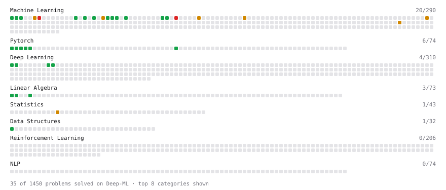

# Deep-ML

My machine learning practice from [Deep-ML](https://www.deep-ml.com). Every solution here was written by hand.

**41** solved · 28 problems · 1 labs · 12 math

[**Browse the interactive portfolio**](https://Istiaaak.github.io/deep-ml/) to replay this filling in over time.

## Problems

| | Difficulty | Solved | |
| --- | --- | --- | --- |
| [Binary Classification with Logistic Regression](https://www.deep-ml.com/problems/104) | easy | 2026-09-18 | [solution](problems/0104-binary-classification-with-logistic-regression) |
| [Calculate Accuracy Score](https://www.deep-ml.com/problems/36) | easy | 2026-09-18 | [solution](problems/0036-calculate-accuracy-score) |
| [Calculate Mean Absolute Error (MAE)](https://www.deep-ml.com/problems/93) | easy | 2026-09-17 | [solution](problems/0093-calculate-mean-absolute-error-mae) |
| [Calculate Root Mean Square Error (RMSE)](https://www.deep-ml.com/problems/71) | easy | 2026-09-17 | [solution](problems/0071-calculate-root-mean-square-error-rmse) |
| [Create a Float Tensor from a Python List](https://www.deep-ml.com/problems/880) | easy | 2026-09-21 | [solution](problems/0880-create-a-float-tensor-from-a-python-list) |
| [Feature Scaling Implementation](https://www.deep-ml.com/problems/16) | easy | 2026-09-16 | [solution](problems/0016-feature-scaling-implementation) |
| [Implement F-Score Calculation for Binary Classification](https://www.deep-ml.com/problems/61) | easy | 2026-09-18 | [solution](problems/0061-implement-f-score-calculation-for-binary-classification) |
| [Implement Gini Impurity Calculation for a Set of Classes](https://www.deep-ml.com/problems/64) | easy | 2026-09-19 | [solution](problems/0064-implement-gini-impurity-calculation-for-a-set-of-classes) |
| [Implement Precision Metric](https://www.deep-ml.com/problems/46) | easy | 2026-09-18 | [solution](problems/0046-implement-precision-metric) |
| [Implement Recall Metric in Binary Classification](https://www.deep-ml.com/problems/52) | easy | 2026-09-18 | [solution](problems/0052-implement-recall-metric-in-binary-classification) |
| [Implement ReLU Activation Function](https://www.deep-ml.com/problems/42) | easy | 2026-09-21 | [solution](problems/0042-implement-relu-activation-function) |
| [Implement Ridge Regression Loss Function](https://www.deep-ml.com/problems/43) | easy | 2026-09-18 | [solution](problems/0043-implement-ridge-regression-loss-function) |
| [Leaky ReLU Activation Function](https://www.deep-ml.com/problems/44) | easy | 2026-09-21 | [solution](problems/0044-leaky-relu-activation-function) |
| [Linear Regression Using Gradient Descent](https://www.deep-ml.com/problems/15) | easy | 2026-09-17 | [solution](problems/0015-linear-regression-using-gradient-descent) |
| [Linear Regression Using Normal Equation](https://www.deep-ml.com/problems/14) | easy | 2026-09-17 | [solution](problems/0014-linear-regression-using-normal-equation) |
| [Matrix-Vector Dot Product](https://www.deep-ml.com/problems/1) | easy | 2026-09-03 | [solution](problems/0001-matrix-vector-dot-product) |
| [Min-Max Scaling of Feature Values](https://www.deep-ml.com/problems/112) | easy | 2026-09-03 | [solution](problems/0112-min-max-scaling-of-feature-values) |
| [Reshape and Transpose a Tensor](https://www.deep-ml.com/problems/881) | easy | 2026-09-21 | [solution](problems/0881-reshape-and-transpose-a-tensor) |
| [Scalar Multiplication of a Matrix](https://www.deep-ml.com/problems/5) | easy | 2026-09-03 | [solution](problems/0005-scalar-multiplication-of-a-matrix) |
| [Sigmoid Activation Function Understanding](https://www.deep-ml.com/problems/22) | easy | 2026-09-21 | [solution](problems/0022-sigmoid-activation-function-understanding) |
| [Softmax Activation Function Implementation ](https://www.deep-ml.com/problems/23) | easy | 2026-09-21 | [solution](problems/0023-softmax-activation-function-implementation) |
| [Transpose of a Matrix](https://www.deep-ml.com/problems/2) | easy | 2026-09-03 | [solution](problems/0002-transpose-of-a-matrix) |
| [Implement K-Nearest Neighbors](https://www.deep-ml.com/problems/173) | medium | 2026-09-20 | [solution](problems/0173-implement-k-nearest-neighbors) |
| [Implement Lasso Regression using ISTA](https://www.deep-ml.com/problems/50) | medium | 2026-09-18 | [solution](problems/0050-implement-lasso-regression-using-ista) |
| [Learning Curve Generator for Bias-Variance Diagnosis](https://www.deep-ml.com/problems/800) | medium | 2026-09-19 | [solution](problems/0800-learning-curve-generator-for-bias-variance-diagnosis) |
| [Maximum A Posteriori (MAP) Estimation for Bernoulli Parameter](https://www.deep-ml.com/problems/338) | medium | 2026-09-20 | [solution](problems/0338-maximum-a-posteriori-map-estimation-for-bernoulli-parameter) |
| [Maximum Likelihood Estimation for Gaussian Distribution](https://www.deep-ml.com/problems/337) | medium | 2026-09-20 | [solution](problems/0337-maximum-likelihood-estimation-for-gaussian-distribution) |
| [Train Logistic Regression with Gradient Descent](https://www.deep-ml.com/problems/106) | hard | 2026-09-18 | [solution](problems/0106-train-logistic-regression-with-gradient-descent) |

## Labs

| | Difficulty | Solved | |
| --- | --- | --- | --- |
| [Train a Linear Regression Model](https://www.deep-ml.com/labs/18) | easy | 2026-09-17 | [solution](labs/0018-train-a-linear-regression-model) |

## Math

| | Difficulty | Solved | |
| --- | --- | --- | --- |
| [Derivatives and Gradients](https://www.deep-ml.com/math-problems/1) | easy | 2026-09-16 | [solution](math/0001-derivatives-and-gradients) |
| [Descriptive Statistics](https://www.deep-ml.com/math-problems/18) | easy | 2026-09-16 | [solution](math/0018-descriptive-statistics) |
| [Expectation and Variance Algebra](https://www.deep-ml.com/math-problems/33) | easy | 2026-09-16 | [solution](math/0033-expectation-and-variance-algebra) |
| [Gradient Descent Updates](https://www.deep-ml.com/math-problems/5) | easy | 2026-09-16 | [solution](math/0005-gradient-descent-updates) |
| [ML Workflow Basics](https://www.deep-ml.com/math-problems/30) | easy | 2026-09-03 | [solution](math/0030-ml-workflow-basics) |
| [Vector Operations](https://www.deep-ml.com/math-problems/7) | easy | 2026-09-03 | [solution](math/0007-vector-operations) |
| [Covariance and Correlation](https://www.deep-ml.com/math-problems/17) | medium | 2026-09-18 | [solution](math/0017-covariance-and-correlation) |
| [Least Squares and the Normal Equations](https://www.deep-ml.com/math-problems/34) | medium | 2026-09-16 | [solution](math/0034-least-squares-and-the-normal-equations) |
| [Regularization and Generalization](https://www.deep-ml.com/math-problems/31) | medium | 2026-09-16 | [solution](math/0031-regularization-and-generalization) |
| [Training Error, Test Error and the Bayes Rate](https://www.deep-ml.com/math-problems/104) | medium | 2026-09-17 | [solution](math/0104-training-error-test-error-and-the-bayes-rate) |
| [Vector Norms and Linear Independence](https://www.deep-ml.com/math-problems/8) | medium | 2026-09-03 | [solution](math/0008-vector-norms-and-linear-independence) |
| [Eigendecomposition and SVD](https://www.deep-ml.com/math-problems/16) | hard | 2026-09-18 | [solution](math/0016-eigendecomposition-and-svd) |

---

_This file is regenerated by Deep-ML on every push._
